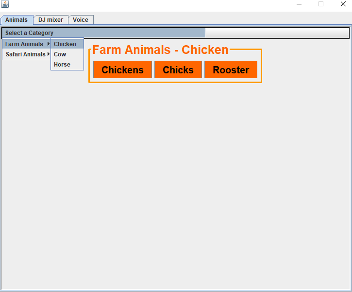
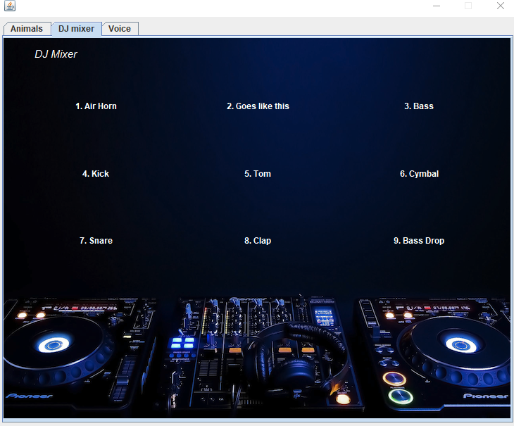
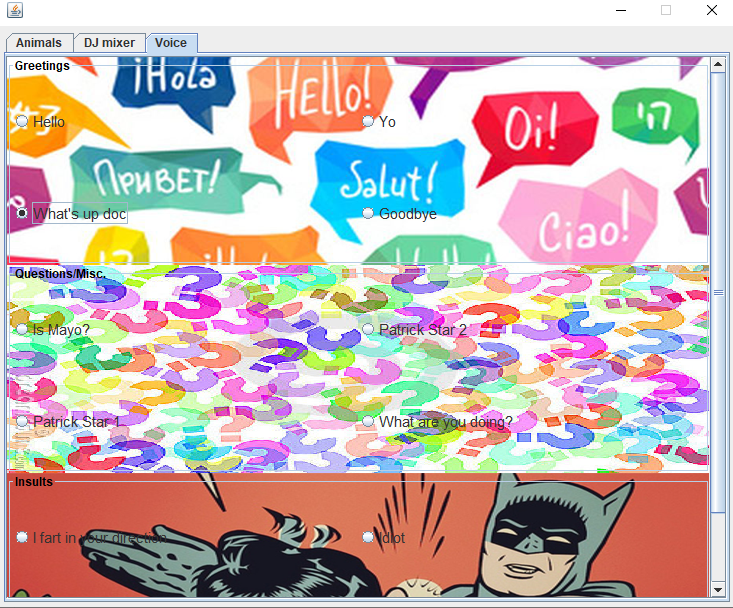

# Java-soundboard
## GUI  soundboard built using java

Fun Java GUI project from 2016, three tabs in one window with sound buttons on each tab, see photos below. In the DJ tab, the buttons are also mapped to the numbers on keyboard and user can play drums. This was build using eclipse 4.5.2 or mars 2 with Jdk 8 which had the sun.audio library. If pulled, user may have problems running in newer IDE. An archive file export from eclipse is provided but in order to use it the eclipse environment needs to be similar, i.e. mars 2 with Jdk 8. 

 

 <em>Figure 1: Animals tab</em>

 

 <em>Figure 2: DJ tab</em>

 

 <em>Figure 3: Voice tab</em>

